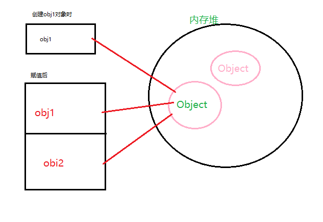

### '='号赋值

#### 基本类型使用等号赋值

* 基本类型中一个变量向另一个变量复制值时，会在变量对象上创建一个新值。然后吧该值复制到为新变量分配
的位置上。两个变量时互相独立的，互不影响，改变其中一个不会影响另一个。
```js
    /**
     * 基本类型赋值
     */
    var a1 = 5;
    var a2 = a1;
    a1 = a1 + 5;
    console.log(a1);// 10
    console.log(a2);// 5
```

* 引用类型赋值：一个变量赋给另一个变量时，会互相影响，实质是一个指针。两个变量指向的是同一个对象。
```js
    /**
     * 引用类型赋值
     */
    var obj1 = {
        name: 'luo'
    }
    var obj2 = obj1;// 将obj1赋给obj2
    obj1.value = 'men';
    console.log(obj1);// {name:'luo',value: 'men'}
    console.log(obj2);// {name:'luo',value: 'men'}
```
存储如图所示

