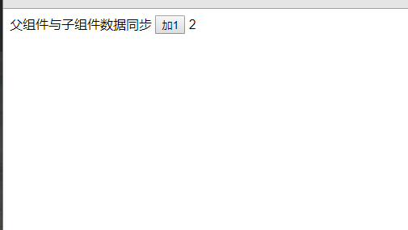

### vue父组件与子组件数据同步
* 案例: 点击子组件的按钮，触发一个一个事件使数据加1，在父组件中将改变后的数据同步显示出来

* 创建一个父组件a.vue文件，代码如下：
```
<template>
  <div>
    父组件与子组件数据同步
    <oo-aa :data.sync="data"></oo-aa>
    {{data}}
  </div>
</template>

<script>
  import OoAa from './oo-aa'
  export default {
    name: 'parent',
    components:{
      OoAa
    },
    data() {
      return {
        data: 1
      }
    }
  }
</script>
```
* 创建一个子组件oo-aa.vue文件
```
<template>
  <button @click="add">加1</button>
</template>

<script>
  export default {
    name: 'children',
    props: ['data'],
    data () {
      return {
        clickData: this.data
      }
    },
    methods: {
      /**
       * 点击事件时改变数据，让数据加1
       * */
      add () {
        this.clickData = this.clickData + 1
      }
    },
    watch: {
      /**
       * 监听父组件传过来的数据，如果改变就改变子组件的数据
       */
      data: {
        handler (val) {
          this.clickData = val
        },
        deep: true
      },
      /**
       * 监听子组件的数据变化。如果改变就将父组件的数据改变
       */
      clickData: {
        handler (val) {
          this.$emit('update:data', val)
        },
        deep: true
      }
    }
  }
</script>

```
* 效果图如下


